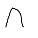

# Nope

Chrome extension for when you feel the urge to nope. Simply put it will remove page content accompanied with a humorous 'nope'.

---

Apparently i have to pay to push things to the Chrome store. Whilst the world would love to have access to this i don't want to pay money.

* To manually install clone or download this repo.
* In Chrome navigate to `chrome://extensions`
* Click `Developer Mode` in the top right.
* Click `Load Unpacked` in the top left.
* Navigate to the root of this repository (the folder containing the `manifest.json`) and select the folder.
* Click the wonderful new `Nope` icon in the top right of your browser.

* Click anywhere and enjoy the hours of light entertainment available to you.